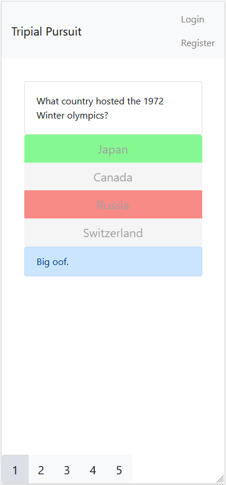

# TripialPursuit
A procedurally generated questionaire

## How to run
It is recommended that you create an empty virtual enviroment before using the project, to avoid version-conflicts.

1. navigate to where the requirements.txt is located
2. ```pip install -r requirements.txt```
3. navigate to the folder containing manage.py (```cd wiki_quiz``` from folder with requirements.txt.)
4. To run site locally, run django with ```python manage.py runserver```

## Important File explanation:
### Querying
- wiki_quiz/game/create_local_data/**Create_local_data.py**

        Performs SPARQL queries, and stores the data locally.

- wiki_quiz/game/create_local_data/**queries.py**

        Queries as strings in a dict.

### Processing and preparing for django
- wiki_quiz/game/create_questions/**data_types.py**

        Describes our datatypes 'Question' and 'Answer'.

- wiki_quiz/game/create_questions/**geography_questions.py**

        Functions for generating a geography-question. Used by main.py.

- wiki_quiz/game/create_questions/**movie_questions.py**

        Functions for generating a movie-question. Used by main.py.

- wiki_quiz/game/create_questions/**undefined_question.py**

        A test to check the quality of questions if we let the user select any topic on Wikidata.
        This feature was a proof of concept and not used in the final UI due to the poor quality of the generated questions. 

- wiki_quiz/game/create_questions/**main.py**

        Takes arguments from django and creates questions based on arguments.
        Uses functions from 'movie_questions.py' and 'geography_questions.py'.


Demo:
  